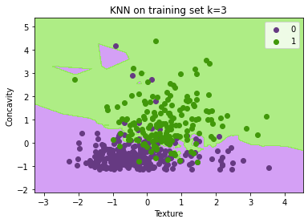
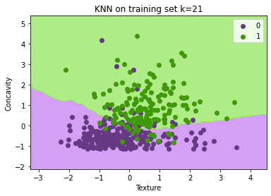
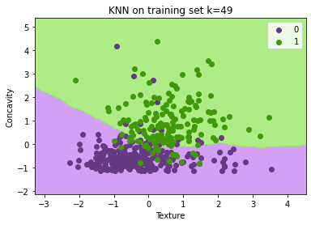
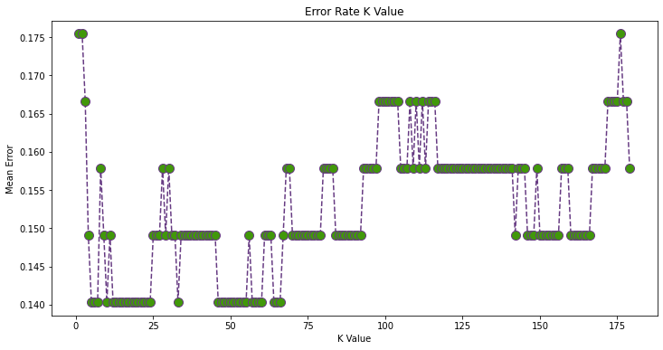
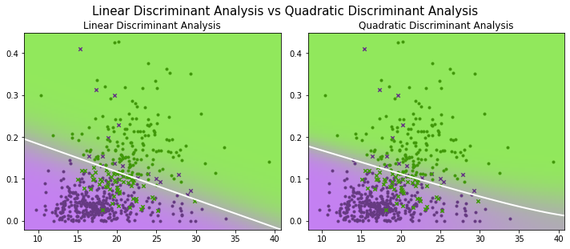
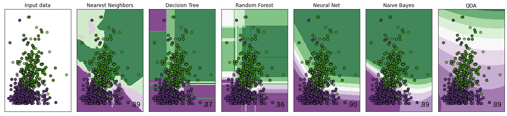

# Classification Problem
This repository contains my code for my first year project of making a poster comparing different classification methods.
The data is properties of breast cancer cell nuclei. I have done the classification methods in both R and Python and both scripts are contained here. There are also the extra images and graphs that there wasn't room for on the poster as well as the poster itself which is made in LaTeX.

## Sources and Acknowledgements:
Sources:

https://archive.ics.uci.edu/ml/datasets/Breast+Cancer+Wisconsin+%28Diagnostic%29

https://towardsdatascience.com/machine-learning-basics-with-the-k-nearest-neighbors-algorithm-6a6e71d01761

https://machinelearningmastery.com/bayes-optimal-classifier/

https://datascienceplus.com/how-to-perform-logistic-regression-lda-qda-in-r/#:~:text=LDA%20(Linear%20Discriminant%20Analysis)%20is,for%20all%20class%20is%20normal.

https://towardsdatascience.com/guide-to-interpretable-machine-learning-d40e8a64b6cf#:~:text=The%20higher%20the%20interpretability%20of,decisions%20from%20the%20other%20model.

https://pythonspot.com/k-nearest-neighbors/

https://stackabuse.com/k-nearest-neighbors-algorithm-in-python-and-scikit-learn

https://scikit-learn.org/stable/auto_examples/classification/plot_lda_qda.html

http://www.science.smith.edu/~jcrouser/SDS293/labs/lab5-py.html

Acknowledgements:
Thank you to Tim Pizey for making me get github when I was 10, for helping me set up this repository and adding a full stop to this README.
